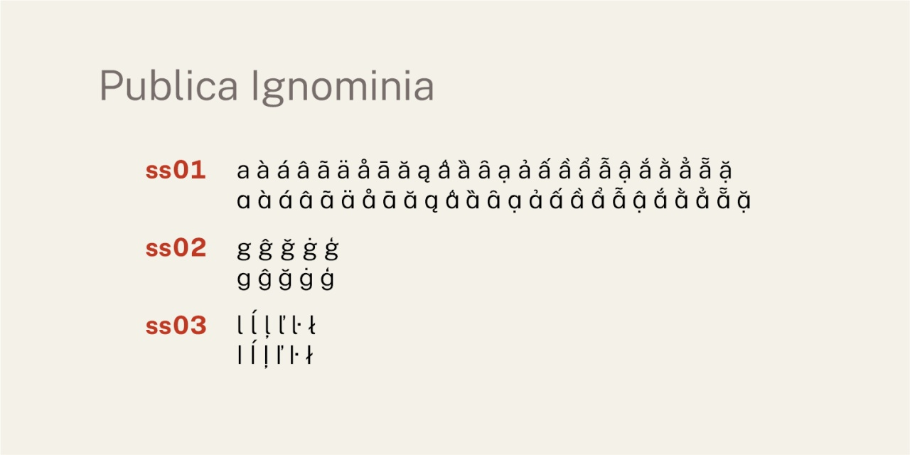

# Publica Ignominia
- Versione 1.165: revisione generale della larghezza dei caratteri combinati.
- Versione 1.159: fix larghezza caratteri.
- Versione 1.158: fix % ‰ ‱.
- Versione 1.155: fix crenatura per numeri (dnum, numr).
- Versione 1.153: fix frazioni, dnom, numr, 1.pnum.
- Versione 1.121: aggiunta e sistemazione di alcuni caratteri (compreso zero tagliato).
- Versione 1.112: aggiunta di alcuni caratteri (‖ ← ↑ → ↓).
- Versione 1.107: fix nomi dei font.
- Versione 1.105: sistemazione varianti _a_ (__ss01__), _g_ (__ss02__) e _l_ (__ss03__).
- Versione 1.0: versione iniziale.

Per maggiori informazioni e per testare il font, vedere la [pagina interattiva](https://m-casanova.github.io/PublicaIgnominia/).

## Utilizzo
Il font può essere utilizzato tramite un unico file in formato WOFF2 con il seguente codice CSS. Ovviamente il percorso del file deve essere adattato alla specifica situazione.

    @font-face {
        font-family: "Publica Ignominia";
        font-weight: 100 900;
        src: url("PublicaIgnominia.woff2") format("woff2-variations");
    }

Per ottenere correttamente il corsivo con Chrome e Opera, utilizzare il seguente codice CSS.

    em, i { font-variation-settings: "ital" 1; font-style:normal }

## Descrizione

_Publica Ignominia_ è un font variabile basato su _[Public Sans](https://github.com/uswds/public-sans)_ (con alcune modifiche); il font _Public Sans_ deriva da _[Libre Franklin](https://github.com/impallari/Libre-Franklin)_.

Il font variabile è rilasciato nei formati WOFF2 e TTF con licenza OFL 1.1.

## Opentype

